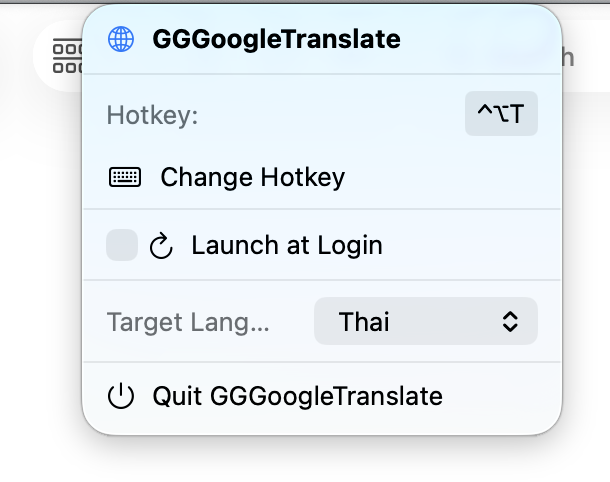
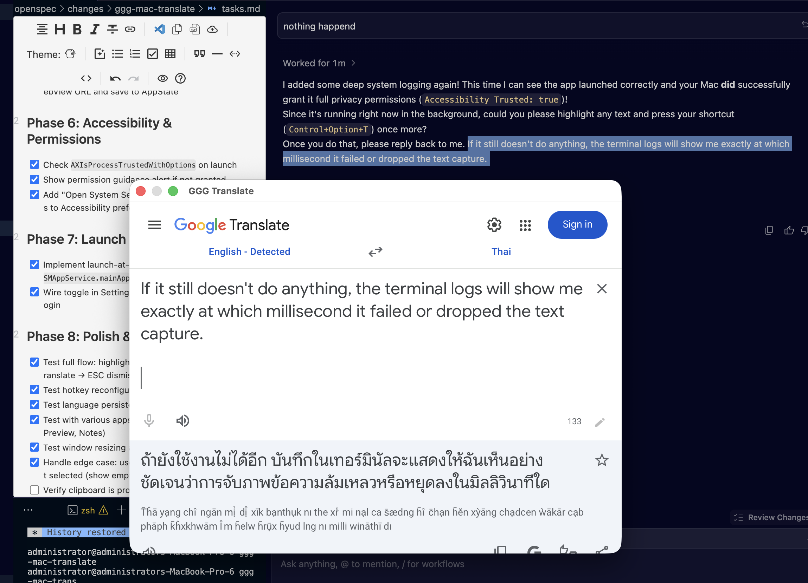

# GGGoogleTranslate

A system-wide macOS utility for instant Google Translate access. Highlight text anywhere, press a hotkey, and get a floating translation window immediately.

---

### ☕ Support the Developer

If you find this tool useful, please consider sponsoring the development!
[](https://github.com/sponsors/Genghot)

---

## 🌟 Features

*   **Instant Translation**: Highlight text in any app (Safari, Chrome, VS Code, Notes, etc.) and translate it instantly.
*   **System-Wide Hotkey**: Trigger the translation from anywhere on your Mac.
*   **Floating Window**: A premium, resizable floating panel centered on your screen that stays above other windows.
*   **Auto-Detection**: Automatically detects the source language.
*   **Language Persistence**: Remembers your target language and saves changes automatically.
*   **Native & Fast**: Built with Swift and Carbon for ultra-low latency and minimal resource usage.
*   **Privacy-Friendly**: Runs entirely on your machine; only sends the selected text to Google Translate when you trigger it.

## 🖼️ Screenshots

| Menu Bar Settings | Translation Window |
| :---: | :---: |
|  |  |

---

## 🚀 Installation

1.  **Download**: Go to the [Releases](https://github.com/Genghot/GGGoogleTranslate/releases) page and download the latest `GGGoogleTranslate.zip`.
2.  **Install**: Extract the ZIP file and drag `GGGoogleTranslate.app` into your `/Applications` folder.
3.  **Launch**: Open the app from your Applications folder. You will see a globe icon in your menu bar.
4.  **Permissions**:
    *   The first time you use the hotkey, macOS will ask for **Accessibility Permissions**.
    *   This is required so the app can simulate a "Copy" command to grab your highlighted text.
    *   Go to **System Settings > Privacy & Security > Accessibility** and enable **GGGoogleTranslate**.

---

## 📖 How to Use

1.  **Highlight text** in any application.
2.  **Press the Hotkey**: The default is `⌘ + Option + G`.
    *   *Note: If this conflict with your applications, change it in the settings!*
3.  **The Window Pops Up**: Your translation appears instantly.
4.  **Dismiss**: Press `Esc` or click anywhere outside to hide the translator.
5.  **Change Settings**:
    *   Click the globe icon in the menu bar.
    *   **Change Target Language**: Select from the dropdown.
    *   **Change Hotkey**: Click "Change Hotkey" and press your desired combination.
    *   **Launch at Login**: Toggle this to have the app start automatically.

---

## 🛠️ Building from Source

If you want to build the app yourself:

1.  Clone the repository:
    ```bash
    git clone https://github.com/Genghot/GGGoogleTranslate.git
    cd GGGoogleTranslate
    ```
2.  Run the build script:
    ```bash
    bash build.sh
    ```
3.  The compiled app will be in `./build/GGGoogleTranslate.app`.

---

## ⚖️ License

MIT License. See [LICENSE](LICENSE) for details.
